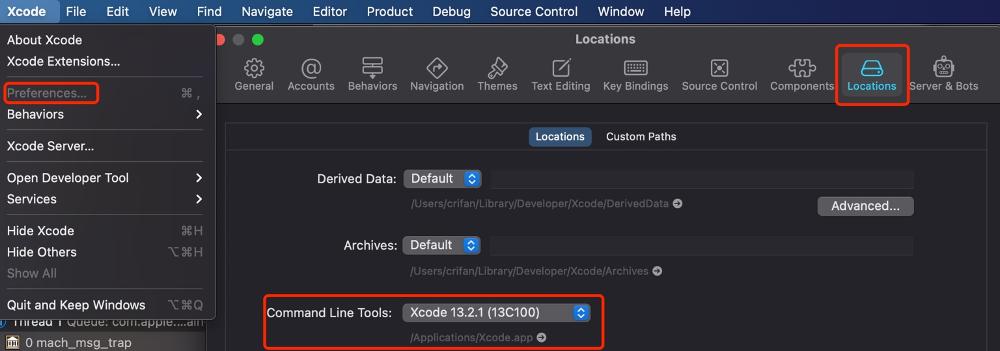

# Command Line Tools

TODO：

* 【已解决】Mac中已登录苹果开发者账号点击下载Command Line Tool提示Unauthorized没权限

---

Xcode，除了有图形界面的UI外，还额外提供了一些，基于命令行的各种工具=`Command Line Tools`

* `Command Line Tools`
  * 是什么：`Xcode`的基于命令行的各种命令行工具。
  * 安装位置：`/Library/Developer/CommandLineTools/`
  * 包含哪些
    * 命令行工具
      * `xcodebuild`
      * `xcrun`
      * 各种子命令
        * `clang` = `Apple LLVM compiler`
        * linker
        * Make
        * 等
    * macOS SDK和头文件header
  * Xcode界面中会提到
    * `Xcode`->`Preferences`->`Locations`->`Locations`->`Command Line Tools`: 此处是 `Xcode 13.2.1 (13C100)`
      * 

## 包含的全部命令

更多的命令，详见：

* `/Applications/Xcode.app/Contents/Developer/Toolchains/XcodeDefault.xctoolchain/usr/bin`

举例：

```bash
 ll /Applications/Xcode.app/Contents/Developer/Toolchains/XcodeDefault.xctoolchain/usr/bin
total 800272
-rwxr-xr-x  1 crifan  staff   265K 12 15  2021 air-ar
-rwxr-xr-x  1 crifan  staff   265K 12 15  2021 air-as
-rwxr-xr-x  1 crifan  staff   265K 12 15  2021 air-dsymutil
-rwxr-xr-x  1 crifan  staff   265K 12 15  2021 air-libtool
-rwxr-xr-x  1 crifan  staff   265K 12 15  2021 air-link
-rwxr-xr-x  1 crifan  staff   265K 12 15  2021 air-lipo
-rwxr-xr-x  1 crifan  staff   265K 12 15  2021 air-lld
-rwxr-xr-x  1 crifan  staff   265K 12 15  2021 air-nm
-rwxr-xr-x  1 crifan  staff   265K 12 15  2021 air-objdump
lrwxr-xr-x  1 crifan  staff     6B  6 28 20:26 air-ranlib -> air-ar
-rwxr-xr-x  1 crifan  staff   265K 12 15  2021 air-readobj
-rwxr-xr-x  1 crifan  staff   265K 12 15  2021 air-size
-rwxr-xr-x  1 crifan  staff   168K 12 15  2021 ar
-rwxr-xr-x  1 crifan  staff   150K 12 15  2021 as
-rwxr-xr-x  1 crifan  staff   163K 12 15  2021 asa
-rwxr-xr-x  1 crifan  staff   520K 12 15  2021 bison
-rwxr-xr-x  1 crifan  staff   434K 12 15  2021 bitcode_strip
lrwxr-xr-x  1 crifan  staff     5B  6 28 20:27 c++ -> clang
lrwxr-xr-x  1 crifan  staff    12B  6 28 20:27 c++filt -> llvm-cxxfilt
-rwxr-xr-x  1 crifan  staff   164K 12 15  2021 c89
-rwxr-xr-x  1 crifan  staff   164K 12 15  2021 c99
lrwxr-xr-x  1 crifan  staff     5B  6 28 20:27 cc -> clang
-rwxr-xr-x  1 crifan  staff   181M 12 15  2021 clang
lrwxr-xr-x  1 crifan  staff     5B  6 28 20:27 clang++ -> clang
-rwxr-xr-x  1 crifan  staff    80M 12 15  2021 clangd
-rwxr-xr-x  1 crifan  staff   350K 12 15  2021 cmpdylib
-rwxr-xr-x  1 crifan  staff   382K 12 15  2021 codesign_allocate
lrwxr-xr-x  1 crifan  staff    17B  6 28 20:27 codesign_allocate-p -> codesign_allocate
lrwxr-xr-x  1 crifan  staff    14B  6 28 20:27 coremlc -> coremlcompiler
-rwxr-xr-x  1 crifan  staff    20M 12 15  2021 coremlcompiler
-rwxr-xr-x  1 crifan  staff   3.3K 10 26  2021 cpp
-rwxr-xr-x  1 crifan  staff   164K 12 15  2021 ctags
-rwxr-xr-x  1 crifan  staff   433K 12 15  2021 ctf_insert
-rwxr-xr-x  1 crifan  staff    19M 12 15  2021 docc
-rwxr-xr-x  1 crifan  staff    61M 12 15  2021 dsymutil
lrwxr-xr-x  1 crifan  staff    14B  6 28 20:28 dwarfdump -> llvm-dwarfdump
-rwxr-xr-x  1 crifan  staff   1.5M 12 15  2021 dwarfdump-classic
-rwxr-xr-x  1 crifan  staff   497K 12 15  2021 dyldinfo
-rwxr-xr-x  2 crifan  staff   681K 12 15  2021 flex
-rwxr-xr-x  2 crifan  staff   681K 12 15  2021 flex++
lrwxr-xr-x  1 crifan  staff     8B  6 28 20:29 gcov -> llvm-cov
-rwxr-xr-x  2 crifan  staff   392K 12 15  2021 gm4
-rwxr-xr-x  1 crifan  staff   294K 12 15  2021 gperf
-rwxr-xr-x  1 crifan  staff   267K 12 15  2021 iig
-rwxr-xr-x  1 crifan  staff   229K 12 15  2021 indent
-rwxr-xr-x  1 crifan  staff   433K 12 15  2021 install_name_tool
-rwxr-xr-x  1 crifan  staff   5.6M 12 15  2021 ld
-rwxr-xr-x  1 crifan  staff   230B 10 26  2021 lex
-rwxr-xr-x  1 crifan  staff   434K 12 15  2021 libtool
-rwxr-xr-x  1 crifan  staff   253K 12 15  2021 lipo
-rwxr-xr-x  1 crifan  staff   8.2M 12 15  2021 llvm-cov
-rwxr-xr-x  1 crifan  staff   859K 12 15  2021 llvm-cxxfilt
-rwxr-xr-x  1 crifan  staff    17M 12 15  2021 llvm-dwarfdump
-rwxr-xr-x  1 crifan  staff    20M 12 15  2021 llvm-nm
-rwxr-xr-x  1 crifan  staff    23M 12 15  2021 llvm-objdump
-rwxr-xr-x  1 crifan  staff   184K 12 15  2021 llvm-otool
-rwxr-xr-x  1 crifan  staff   3.6M 12 15  2021 llvm-profdata
-rwxr-xr-x  1 crifan  staff   6.7M 12 15  2021 llvm-size
-rwxr-xr-x  1 crifan  staff   3.5K 10 26  2021 lorder
-rwxr-xr-x  2 crifan  staff   392K 12 15  2021 m4
-rwxr-xr-x  1 crifan  staff   265K 12 15  2021 metal
lrwxr-xr-x  1 crifan  staff     6B  6 28 20:32 metal-ar -> air-ar
lrwxr-xr-x  1 crifan  staff     6B  6 28 20:32 metal-as -> air-as
lrwxr-xr-x  1 crifan  staff    12B  6 28 20:32 metal-dsymutil -> air-dsymutil
lrwxr-xr-x  1 crifan  staff    11B  6 28 20:32 metal-libtool -> air-libtool
lrwxr-xr-x  1 crifan  staff     8B  6 28 20:32 metal-link -> air-link
lrwxr-xr-x  1 crifan  staff     8B  6 28 20:32 metal-lipo -> air-lipo
lrwxr-xr-x  1 crifan  staff     7B  6 28 20:32 metal-lld -> air-lld
lrwxr-xr-x  1 crifan  staff     6B  6 28 20:32 metal-nm -> air-nm
lrwxr-xr-x  1 crifan  staff    11B  6 28 20:32 metal-objdump -> air-objdump
lrwxr-xr-x  1 crifan  staff    10B  6 28 20:32 metal-ranlib -> air-ranlib
lrwxr-xr-x  1 crifan  staff    11B  6 28 20:32 metal-readobj -> air-readobj
lrwxr-xr-x  1 crifan  staff     8B  6 28 20:32 metal-size -> air-size
-rwxr-xr-x  1 crifan  staff   265K 12 15  2021 metal-source
lrwxr-xr-x  1 crifan  staff     7B  6 28 20:32 metallib -> air-lld
-rwxr-xr-x  1 crifan  staff   7.7K 10 26  2021 mig
lrwxr-xr-x  1 crifan  staff     7B  6 28 20:32 nm -> llvm-nm
-rwxr-xr-x  1 crifan  staff   383K 12 15  2021 nm-classic
-rwxr-xr-x  1 crifan  staff   467K 12 15  2021 nmedit
lrwxr-xr-x  1 crifan  staff    12B  6 28 20:32 objdump -> llvm-objdump
lrwxr-xr-x  1 crifan  staff    10B  6 28 20:32 otool -> llvm-otool
-rwxr-xr-x  1 crifan  staff   1.4M 12 15  2021 otool-classic
-rwxr-xr-x  1 crifan  staff   382K 12 15  2021 pagestuff
lrwxr-xr-x  1 crifan  staff     7B  6 28 20:33 ranlib -> libtool
-rwxr-xr-x  1 crifan  staff   261K 12 15  2021 rpcgen
-rwxr-xr-x  1 crifan  staff   186K 12 15  2021 segedit
lrwxr-xr-x  1 crifan  staff    12B  6 28 20:33 size -> size-classic
-rwxr-xr-x  1 crifan  staff   349K 12 15  2021 size-classic
-rwxr-xr-x  1 crifan  staff    30M 12 15  2021 sourcekit-lsp
-rwxr-xr-x  1 crifan  staff   350K 12 15  2021 strings
-rwxr-xr-x  1 crifan  staff   520K 12 15  2021 strip
lrwxr-xr-x  1 crifan  staff    14B  6 28 20:33 swift -> swift-frontend
lrwxr-xr-x  1 crifan  staff    14B  6 28 20:33 swift-api-digester -> swift-frontend
lrwxr-xr-x  1 crifan  staff    14B  6 28 20:33 swift-api-extract -> swift-frontend
-rwxr-xr-x  1 crifan  staff    59M 12 15  2021 swift-build
-rwxr-xr-x  1 crifan  staff   1.4M 12 15  2021 swift-build-tool
-rwxr-xr-x  1 crifan  staff   1.3M 12 15  2021 swift-demangle
-rwxr-xr-x  1 crifan  staff    26M 12 15  2021 swift-driver
-rwxr-xr-x  1 crifan  staff   214M 12 15  2021 swift-frontend
-rwxr-xr-x  1 crifan  staff    11M 12 15  2021 swift-help
-rwxr-xr-x  1 crifan  staff    59M 12 15  2021 swift-package
-rwxr-xr-x  1 crifan  staff    59M 12 15  2021 swift-package-collection
-rwxr-xr-x  1 crifan  staff    59M 12 15  2021 swift-run
-rwxr-xr-x  1 crifan  staff   185K 12 15  2021 swift-stdlib-tool
lrwxr-xr-x  1 crifan  staff    14B  6 28 20:34 swift-symbolgraph-extract -> swift-frontend
-rwxr-xr-x  1 crifan  staff    59M 12 15  2021 swift-test
lrwxr-xr-x  1 crifan  staff    14B  6 28 20:34 swiftc -> swift-frontend
-rwxr-xr-x  1 crifan  staff    33M 12 15  2021 tapi
-rwxr-xr-x  1 crifan  staff   3.1M 12 15  2021 tapi-analyze
-rwxr-xr-x  1 crifan  staff   165K 12 15  2021 unifdef
-rwxr-xr-x  1 crifan  staff   2.9K 10 26  2021 unifdefall
-rwxr-xr-x  1 crifan  staff   203K 12 15  2021 unwinddump
-rwxr-xr-x  1 crifan  staff   220K 12 15  2021 vtool
-rwxr-xr-x  1 crifan  staff   135B 10 26  2021 yacc
```

### 子命令举例

* clang

```bash
 clang -v
Apple clang version 13.0.0 (clang-1300.0.29.30)
Target: x86_64-apple-darwin20.6.0
Thread model: posix
InstalledDir: /Applications/Xcode.app/Contents/Developer/Toolchains/XcodeDefault.xctoolchain/usr/bin
```

* gcc

```bash
 gcc -v
Configured with: --prefix=/Applications/Xcode.app/Contents/Developer/usr --with-gxx-include-dir=/Applications/Xcode.app/Contents/Developer/Platforms/MacOSX.platform/Developer/SDKs/MacOSX.sdk/usr/include/c++/4.2.1
Apple clang version 13.0.0 (clang-1300.0.29.30)
Target: x86_64-apple-darwin20.6.0
Thread model: posix
InstalledDir: /Applications/Xcode.app/Contents/Developer/Toolchains/XcodeDefault.xctoolchain/usr/bin
```
