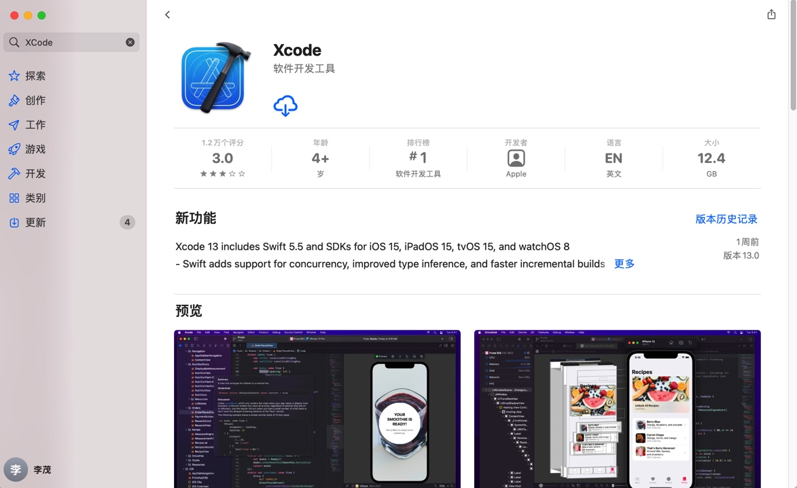
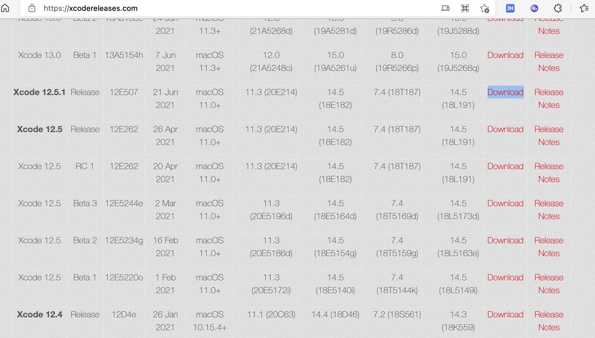

# 安装Xcode

TODO：

* 【已解决】Mac提示：Error Xcode alone is not sufficient on Catalina
* 【已解决】下载直接可以安装的XCode安装文件而非AppStore中下载和安装
* 【已解决】Mac中安装最新版XCode
* 【已解决】Mac中通过AppStore下载和安装XCode

---

## 下载=安装来源

* 安装来源
  * AppStore中搜并安装XCode
    * 此处安装的是最新的`13.0`
      * 
  * 也可以单独从网站中下载特定版本再安装
    * Xcode Releases | xcodereleases.com
      * 举例
        * `12.5.1`
          * 
          * 地址
            * https://developer.apple.com/services-account/download?path=/Developer_Tools/Xcode_12.5.1/Xcode_12.5.1.xip
            * ->
            * https://download.developer.apple.com/Developer_Tools/Xcode_12.5.1/Xcode_12.5.1.xip

> [!Caution|title:安装Xcode前要确认自己的macOS版本是否满足要求]
> 要安装XCode 13.0，发现当前MacOS版本`macOS Catalina 10.15.7`不支持，无法安装。
> 
> 导致了必须去升级macOS到最新版：`macOS 11.6 Big Sur`才能正常继续安装XCode的。

## 安装过程

此处macOS中安装指定版本的11.3.1的XCode：

1. 浏览器打开

[More Software Downloads - Apple Developer](https://developer.apple.com/download/more/)

然后用自己的AppleID账号登录

登录后可以看到，历史上各个版本的XCode

2. 找到自己要的11.3.1的XCode

https://download.developer.apple.com/Developer_Tools/Xcode_11.3.1/Xcode_11.3.1.xip

下载。

3. 下载后，双击
`Xcode_11.3.1.xip`
会自动解压出 Xcode

1. 把XCode拖动到`应用程序`文件夹。

再双击启动，首次会弹框点击同意和输入系统账号和密码。

等待安装成功后，即可。

此处会默认安装：XCode的命令行工具 xcodebuild，所以无需额外下载安装。

注：

如果需要，可以单独下载XCode的命令行工具：

https://download.developer.apple.com/Developer_Tools/Command_Line_Tools_for_Xcode_11.3.1/Command_Line_Tools_for_Xcode_11.3.1.dmg

然后去安装。
