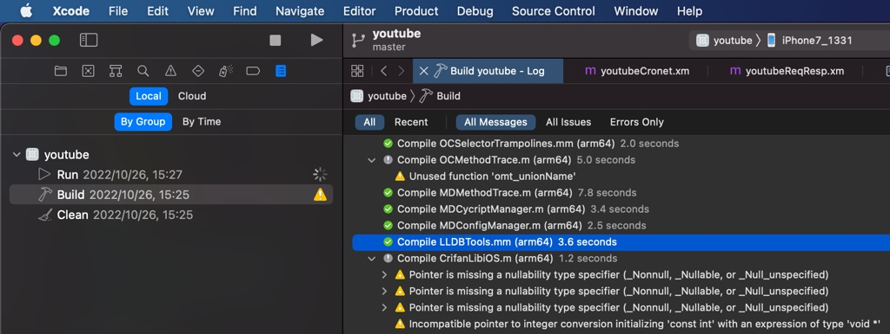
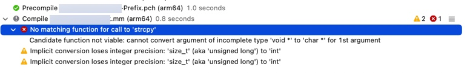
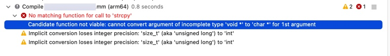
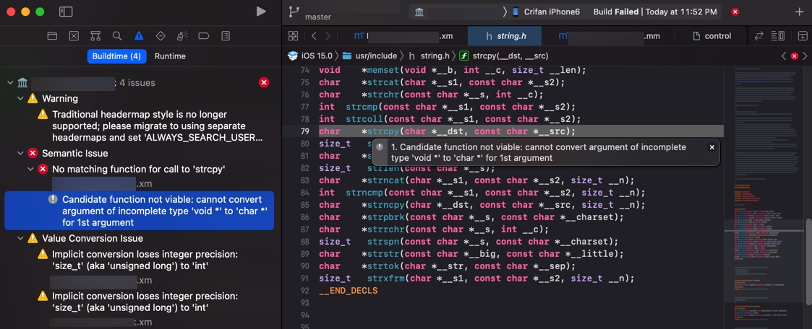

# 调试运行日志

## XCode中可以拷贝出错误日志详情

XCode编译调试的log，看起来很少，很精简：



但是如果去`Command+C`拷贝粘贴出来，其实是完整的详细的内容：

```bash
Showing All Messages
CompileC /Users/crifan/Library/Developer/Xcode/DerivedData/youtube-akcbcgavyfjcpkfbbowmtledboux/Build/Intermediates.noindex/youtube.build/Debug-iphoneos/youtubeDylib.build/Objects-normal/arm64/LLDBTools.o /Users/crifan/dev/dev_root/company/deeper/youtube/XCode/YouTube_1708/block-youtube-ads/youtubeDylib/Tools/LLDBTools.mm normal arm64 objective-c++ com.apple.compilers.llvm.clang.1_0.compiler (in target 'youtubeDylib' from project 'youtube')
    cd /Users/crifan/dev/dev_root/company/deeper/youtube/XCode/YouTube_1708/block-youtube-ads
    export LANG\=en_US.US-ASCII
    /Applications/Xcode.app/Contents/Developer/Toolchains/XcodeDefault.xctoolchain/usr/bin/clang -x objective-c++ -target arm64-apple-ios12.0 -fmessage-length\=0 -fdiagnostics-show-note-include-stack -fmacro-backtrace-limit\=0 -std\=gnu++1z -stdlib\=libc++ -fobjc-arc -fobjc-weak -fmodules -gmodules -fmodules-cache-path\=/Users/crifan/Library/Developer/Xcode/DerivedData/ModuleCache.noindex -fmodules-prune-interval\=86400 -fmodules-prune-after\=345600 -fbuild-session-file\=/Users/crifan/Library/Developer/Xcode/DerivedData/ModuleCache.noindex/Session.modulevalidation -fmodules-validate-once-per-build-session -Wnon-modular-include-in-framework-module -Werror\=non-modular-include-in-framework-module -Wno-trigraphs -fpascal-strings -O0 -fno-common -Wno-missing-field-initializers -Wmissing-prototypes -Wdocumentation -Wunreachable-code -Wquoted-include-in-framework-header -Wno-implicit-atomic-properties -Werror\=deprecated-objc-isa-usage -Wno-objc-interface-ivars -Werror\=objc-root-class -Wno-arc-repeated-use-of-weak -Wimplicit-retain-self -Wno-non-virtual-dtor -Wno-overloaded-virtual -Wno-exit-time-destructors -Wduplicate-method-match -Wno-missing-braces -Wparentheses -Wswitch -Wunused-function -Wno-unused-label -Wno-unused-parameter -Wunused-variable -Wunused-value -Wempty-body -Wuninitialized -Wconditional-uninitialized -Wno-unknown-pragmas -Wno-shadow -Wno-four-char-constants -Wno-conversion -Wconstant-conversion -Wint-conversion -Wbool-conversion -Wenum-conversion -Wno-float-conversion -Wnon-literal-null-conversion -Wobjc-literal-conversion -Wshorten-64-to-32 -Wno-newline-eof -Wno-selector -Wno-strict-selector-match -Wundeclared-selector -Wdeprecated-implementations -Wno-c++11-extensions -DDEBUG\=1 -DOBJC_OLD_DISPATCH_PROTOTYPES\=0 -isysroot /Applications/Xcode.app/Contents/Developer/Platforms/iPhoneOS.platform/Developer/SDKs/iPhoneOS15.2.sdk -fstrict-aliasing -Wprotocol -Wdeprecated-declarations -Winvalid-offsetof -g -fvisibility-inlines-hidden -Wno-sign-conversion -Winfinite-recursion -Wmove -Wcomma -Wblock-capture-autoreleasing -Wstrict-prototypes -Wrange-loop-analysis -Wno-semicolon-before-method-body -Wunguarded-availability -index-store-path /Users/crifan/Library/Developer/Xcode/DerivedData/youtube-akcbcgavyfjcpkfbbowmtledboux/Index/DataStore -iquote /Users/crifan/Library/Developer/Xcode/DerivedData/youtube-akcbcgavyfjcpkfbbowmtledboux/Build/Intermediates.noindex/youtube.build/Debug-iphoneos/youtubeDylib.build/youtubeDylib-generated-files.hmap -I/Users/crifan/Library/Developer/Xcode/DerivedData/youtube-akcbcgavyfjcpkfbbowmtledboux/Build/Intermediates.noindex/youtube.build/Debug-iphoneos/youtubeDylib.build/youtubeDylib-own-target-headers.hmap -I/Users/crifan/Library/Developer/Xcode/DerivedData/youtube-akcbcgavyfjcpkfbbowmtledboux/Build/Intermediates.noindex/youtube.build/Debug-iphoneos/youtubeDylib.build/youtubeDylib-all-target-headers.hmap -iquote /Users/crifan/Library/Developer/Xcode/DerivedData/youtube-akcbcgavyfjcpkfbbowmtledboux/Build/Intermediates.noindex/youtube.build/Debug-iphoneos/youtubeDylib.build/youtubeDylib-project-headers.hmap -I/Users/crifan/Library/Developer/Xcode/DerivedData/youtube-akcbcgavyfjcpkfbbowmtledboux/Build/Products/Debug-iphoneos/include -I/opt/MonkeyDev/include -I/opt/theos/vendor/include -I/opt/theos/vendor/include/.github -I/opt/theos/vendor/include/AVFoundation -I/opt/theos/vendor/include/AddressBookUI -I/opt/theos/vendor/include/AlienBlue -I/opt/theos/vendor/include/Anemone -I/opt/theos/vendor/include/AppKit -I/opt/theos/vendor/include/AppList -I/opt/theos/vendor/include/AppSupport -I/opt/theos/vendor/include/ApplePushService -I/opt/theos/vendor/include/AssertionServices -I/opt/theos/vendor/include/AssistantServices -I/opt/theos/vendor/include/BackBoardServices -I/opt/theos/vendor/include/BaseBoard -I/opt/theos/vendor/include/BaseBoardUI -I/opt/theos/vendor/include/BatteryCenter -I/opt/theos/vendor/include/BiometricKit -I/opt/theos/vendor/include/BiteSMS -I/opt/theos/vendor/include/BluetoothManager -I/opt/theos/vendor/include/BulletinBoard -I/opt/theos/vendor/include/CameraKit -I/opt/theos/vendor/include/CameraUI -I/opt/theos/vendor/include/CaptainHook -I/opt/theos/vendor/include/Celestial -I/opt/theos/vendor/include/ChatKit -I/opt/theos/vendor/include/Contacts -I/opt/theos/vendor/include/ControlCenterUIKit -I/opt/theos/vendor/include/CoreFoundation -I/opt/theos/vendor/include/Flipswitch -I/opt/theos/vendor/include/Foundation -I/opt/theos/vendor/include/FrontBoard -I/opt/theos/vendor/include/FrontBoardServices -I/opt/theos/vendor/include/GeoServices -I/opt/theos/vendor/include/GraphicsServices -I/opt/theos/vendor/include/IMCore -I/opt/theos/vendor/include/IMDaemonCore -I/opt/theos/vendor/include/IMFoundation -I/opt/theos/vendor/include/IMSharedUtilities -I/opt/theos/vendor/include/IOKit -I/opt/theos/vendor/include/IconSupport -I/opt/theos/vendor/include/Jasmine -I/opt/theos/vendor/include/LightMessaging -I/opt/theos/vendor/include/MapKit -I/opt/theos/vendor/include/MaterialKit -I/opt/theos/vendor/include/MediaPlayer -I/opt/theos/vendor/include/MediaPlayerUI -I/opt/theos/vendor/include/MediaRemote -I/opt/theos/vendor/include/MobileCoreServices -I/opt/theos/vendor/include/MobileGestalt -I/opt/theos/vendor/include/MobileIcons -I/opt/theos/vendor/include/MobilePhone -I/opt/theos/vendor/include/MobileSMS -I/opt/theos/vendor/include/MobileTimer -I/opt/theos/vendor/include/OnBoardingKit -I/opt/theos/vendor/include/Pandora -I/opt/theos/vendor/include/PassKitUI -I/opt/theos/vendor/include/PassKitUIFoundation -I/opt/theos/vendor/include/PersistentConnection -I/opt/theos/vendor/include/PersonaKit -I/opt/theos/vendor/include/PersonaUI -I/opt/theos/vendor/include/PhotoLibrary -I/opt/theos/vendor/include/PhotoLibraryServices -I/opt/theos/vendor/include/PhotosUI -I/opt/theos/vendor/include/Preferences -I/opt/theos/vendor/include/PreferencesUI -I/opt/theos/vendor/include/QuartzCore -I/opt/theos/vendor/include/SplashBoard -I/opt/theos/vendor/include/SpringBoard -I/opt/theos/vendor/include/SpringBoardFoundation -I/opt/theos/vendor/include/SpringBoardHome -I/opt/theos/vendor/include/SpringBoardServices -I/opt/theos/vendor/include/SpringBoardUI -I/opt/theos/vendor/include/SpringBoardUIServices -I/opt/theos/vendor/include/StoreKitUI -I/opt/theos/vendor/include/TechSupport -I/opt/theos/vendor/include/TelephonyUI -I/opt/theos/vendor/include/TextInput -I/opt/theos/vendor/include/Tweetbot -I/opt/theos/vendor/include/TwitkaFly -I/opt/theos/vendor/include/UIFoundation -I/opt/theos/vendor/include/UIKit -I/opt/theos/vendor/include/UserNotificationsKit -I/opt/theos/vendor/include/UserNotificationsUIKit -I/opt/theos/vendor/include/Velox -I/opt/theos/vendor/include/auki -I/opt/theos/vendor/include/installd -I/opt/theos/vendor/include/libactivator -I/opt/theos/vendor/include/libarchive -I/opt/theos/vendor/include/libpackageinfo -I/opt/theos/vendor/include/libprefs -I/opt/theos/vendor/include/libstatusbar -I/opt/theos/vendor/include/libundirect -I/opt/theos/vendor/include/logos -I/opt/theos/vendor/include/objc -I/opt/theos/vendor/include/openssl -I/opt/theos/vendor/include/rocketbootstrap -I/opt/theos/vendor/include/theos -I/opt/theos/vendor/include/IOKit/hid -I/opt/theos/vendor/include/IOKit/ps -I/opt/theos/vendor/include/IOKit/pwr_mgt -I/Users/crifan/Library/Developer/Xcode/DerivedData/youtube-akcbcgavyfjcpkfbbowmtledboux/Build/Intermediates.noindex/youtube.build/Debug-iphoneos/youtubeDylib.build/DerivedSources-normal/arm64 -I/Users/crifan/Library/Developer/Xcode/DerivedData/youtube-akcbcgavyfjcpkfbbowmtledboux/Build/Intermediates.noindex/youtube.build/Debug-iphoneos/youtubeDylib.build/DerivedSources/arm64 -I/Users/crifan/Library/Developer/Xcode/DerivedData/youtube-akcbcgavyfjcpkfbbowmtledboux/Build/Intermediates.noindex/youtube.build/Debug-iphoneos/youtubeDylib.build/DerivedSources -F/Users/crifan/Library/Developer/Xcode/DerivedData/youtube-akcbcgavyfjcpkfbbowmtledboux/Build/Products/Debug-iphoneos -F/opt/MonkeyDev/Frameworks -F/opt/MonkeyDev/Frameworks/RevealServer.framework -F/opt/MonkeyDev/Frameworks/RevealServer.framework/Modules -F/opt/MonkeyDev/Librarys -F/opt/theos/vendor/lib -DTHEOS_INSTANCE_NAME\=\"youtubeDylib\" -include /Users/crifan/Library/Developer/Xcode/DerivedData/youtube-akcbcgavyfjcpkfbbowmtledboux/Build/Intermediates.noindex/PrecompiledHeaders/SharedPrecompiledHeaders/11491367307218202437/youtubeDylib-Prefix.pch -MMD -MT dependencies -MF /Users/crifan/Library/Developer/Xcode/DerivedData/youtube-akcbcgavyfjcpkfbbowmtledboux/Build/Intermediates.noindex/youtube.build/Debug-iphoneos/youtubeDylib.build/Objects-normal/arm64/LLDBTools.d --serialize-diagnostics /Users/crifan/Library/Developer/Xcode/DerivedData/youtube-akcbcgavyfjcpkfbbowmtledboux/Build/Intermediates.noindex/youtube.build/Debug-iphoneos/youtubeDylib.build/Objects-normal/arm64/LLDBTools.dia -c /Users/crifan/dev/dev_root/company/deeper/youtube/XCode/YouTube_1708/block-youtube-ads/youtubeDylib/Tools/LLDBTools.mm -o /Users/crifan/Library/Developer/Xcode/DerivedData/youtube-akcbcgavyfjcpkfbbowmtledboux/Build/Intermediates.noindex/youtube.build/Debug-iphoneos/youtubeDylib.build/Objects-normal/arm64/LLDBTools.o
```

## XCode可以展开错误看细节

其实点击报错，是可以展开看到具体错误信息的：

选中当前错误的行：



拷贝出错误的本身的日志：

```bash
Showing Recent Messages
/Users/crifan/dev/DevRoot/zry/iOS_tweak/iOSOpenDev/xxx/xxx/xxx.xm:66:18: No matching function for call to ‘strcpy'
```

展开后，选中详情：



可以粘贴处具体错误详情日志：

```bash
Showing Recent Messages
/Applications/Xcode.app/Contents/Developer/Platforms/iPhoneOS.platform/Developer/SDKs/iPhoneOS15.0.sdk/usr/include/string.h:79:7: Candidate function not viable: cannot convert argument of incomplete type 'void *' to 'char *' for 1st argument
```

后记：

其实左边错误信息中，已列出此具体错误原因了：


